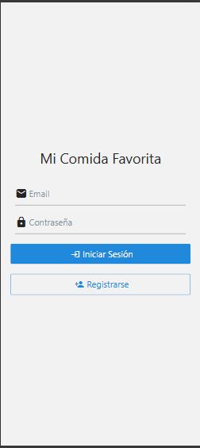
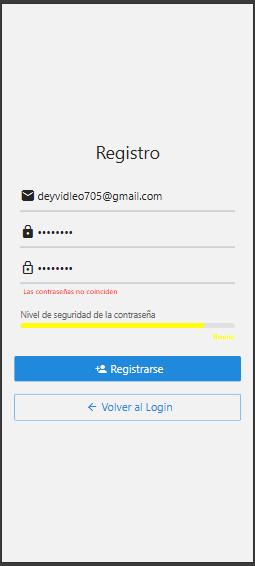
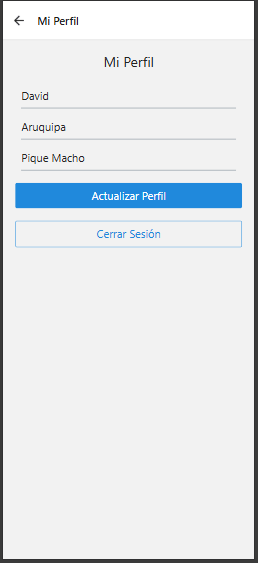
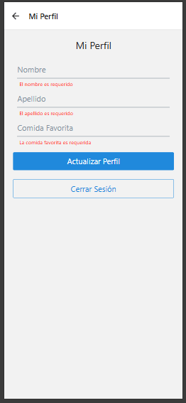

# Mi Comida Favorita

Aplicación móvil desarrollada con React Native que permite a los usuarios gestionar su perfil y compartir su comida favorita.

## 📱 Características

- Autenticación de usuarios con Firebase
- Sistema de registro y login
- Gestión de perfil de usuario
- Validación de formularios
- Almacenamiento de datos en Firestore
- Interfaz de usuario intuitiva y moderna
- Barra Progresiva de nivel de contraseña

## 🚀 Instrucciones de Instalación

1. **Requisitos Previos**
   - Node.js (versión 14 o superior)
   - npm o yarn
   - Expo CLI
   - Cuenta de Firebase

2. **Clonar el Repositorio**
   ```bash
   git clone https://github.com/DeyvidL7/MiComidaFavorita.git
   cd MiComidaFavorita
   ```

3. **Instalar Dependencias**
   ```bash
   npm install
   ```

4. **Configurar Firebase**
   - Crear un proyecto en Firebase Console
   - Habilitar Authentication y Firestore
   - Copiar la configuración de Firebase en `src/config/firebase.js`

5. **Iniciar la Aplicación**
   ```bash
   npm start
   # o
   yarn start
   ```

## 🔄 Mejoras Implementadas

### Versión 1.0
- Sistema de autenticación completo
- Gestión de perfil de usuario
- Validación de formularios
- Mensajes de error y éxito

## 📸 Screenshots

### Pantalla de Login
![Pantalla de Login]


### Pantalla de Registro
![Pantalla de Registro]


### Formulario de Actualizacion de Perfil
![Formulario de Actualizacion de Perfil]


### Formulario de Actualizacion de Perfil con error
![Formulario de Actualizacion de Perfil]


## 🛠️ Tecnologías Utilizadas

- React Native
- Expo
- Firebase (Authentication, Firestore)
- React Native Elements

## 📝 Notas Adicionales

- La aplicación está optimizada para dispositivos móviles
- Se recomienda usar la última versión de Expo Go para probar la aplicación
- Los datos se almacenan en Firebase Firestore
